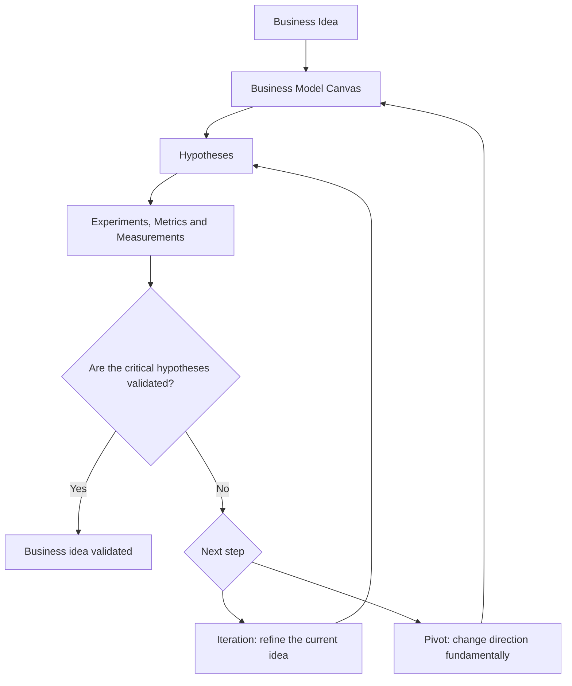

# Evidara

> Validate business ideas before investing significant time, money, and resources.

Evidara is a web-based platform for the structured validation of digital business ideas.

The platform helps founders, startup teams, innovators, and product builders systematically test assumptions, collect evidence, and make informed decisions based on real-world learning rather than intuition.

Instead of focusing on building products as quickly as possible, Evidara focuses on validating whether a business idea is worth building in the first place.

---

## What Evidara Does

Evidara supports the complete validation workflow:

1. Create and manage business ideas
2. Model assumptions using the Business Model Canvas
3. Define testable hypotheses
4. Define metrics and validation thresholds
5. Plan experiments
6. Record measurements
7. Automatically derive validation results
8. Analyze validation progress
9. Create iterations and pivots

---

## Validation Workflow

Validation is treated as a repeatable learning loop:

1. Make assumptions explicit.
2. Test assumptions with measurable criteria.
3. Derive evidence-based outcomes.
4. Continue with iteration or strategic pivot.

The platform does not make business decisions.

It helps users document assumptions, run validation activities, and evaluate evidence in a structured and repeatable way.

---

## Key Features

### Idea Management

* Create and manage business ideas
* Version-based idea evolution
* Iteration and pivot support

### Business Model Canvas

* 9 standard canvas sections
* Structured business model documentation

### Hypothesis Validation

* Problem hypotheses
* Solution hypotheses
* Market hypotheses
* Monetization hypotheses
* Execution hypotheses

### Metrics & Thresholds

* Quantitative validation criteria
* Configurable comparison operators
* Automatic evaluation

### Experiments

* Experiment planning
* Status tracking
* Documentation of validation activities

### Measurements

* Measurement recording
* Threshold comparison
* Automatic validation status derivation

### Dashboard & Analytics

* Validation overview
* Risk visibility
* Progress tracking
* Dimension-based analysis

---

## Live Systems

### Production

https://app.evidara.ch

> Available when the production system is active.

### Test Environment

https://test-idea-validation-platform.jcloud.ik-server.com/

> Available when the test environment is active.

---

## Documentation

### User Documentation

* [Documentation](content/en/documentation.md)
* [How It Works](content/en/how-it-works.md)

### Technical Documentation

* [Architecture Overview](docs/architecture.md)
* [Security Documentation](docs/security.md)
* [OpenAPI Specification](openapi.yml)
* [Bruno API Collection](bruno/)

---

## Architecture

The backend follows a Clean Architecture approach with separation of concerns.

Core principles:

* Separation of concerns
* Framework-independent business logic
* Dependency inversion
* Stateless request handling
* Explicit validation
* Replaceable infrastructure

For details see:

* [Architecture Overview](docs/architecture.md)

---

## Technology Stack

* Nuxt 4
* Vue 3
* TypeScript
* Nuxt UI
* Tailwind CSS
* Nuxt Server Routes
* PostgreSQL
* Prisma ORM
* Better Auth
* Zod
* OpenAPI
* Docker
* GitHub Actions
* Vitest
* ESLint
* ...

---

## Current Status

Current maturity level:

* Functional MVP completed
* Core validation workflow implemented
* Subscription support implemented
* Active development continues

Future features may be added, modified, or removed.

---

## Source Availability

This repository is publicly accessible for educational and portfolio purposes.

The source code may be viewed and studied.

Usage rights are governed by the repository license.

See:

* [LICENSE](LICENSE)

---

## Disclaimer

Evidara is a validation tool.

The platform does not provide:

* legal advice
* financial advice
* investment advice
* business consulting

All business decisions remain the sole responsibility of the user.

---

## Diploma Thesis Project

This project was developed as part of the final diploma thesis for the degree:

**Dipl. Informatiker HF, Application Development**
Specialization: **Application Security**

The project demonstrates the design, implementation, documentation, and security considerations of a modern full-stack SaaS application.

---

## Author

**Luca Knobel**

* GitHub: https://github.com/LucaKnobel
* Website: https://lucaknobel.ch

---

Built as part of the Diploma Thesis Project 2026.
